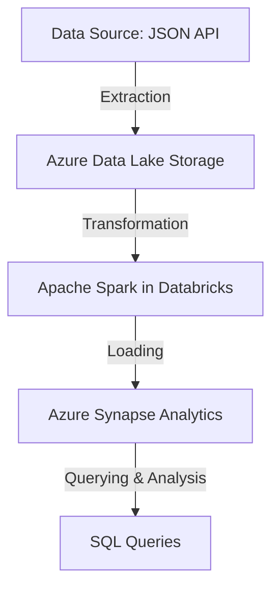

# Azure-Spark-SQL-Databricks-Pipeline

This project implements a **data processing pipeline** using **Azure Synapse Analytics, Azure Data Lake Storage, Apache Spark in Databricks, and SQL queries** to transform and analyze data.

##  Project Purpose
The goal of this pipeline is to demonstrate how to **Extract, Transform, and Load (ETL) data from a JSON source to Azure**, optimizing storage and analysis through **Apache Spark in Databricks and SQL**. It is a scalable solution for **Big Data environments**, enabling efficient processing of large data volumes while leveraging **Databricks' distributed computing capabilities**.

###  Use Case
This pipeline simulates a **data flow in an e-commerce company** that needs to analyze user interactions on its platform. Data is extracted from a public API, transformed using **Apache Spark in Databricks** for cleaning and structuring, and then stored in **Azure Synapse Analytics** for further analysis and reporting.

## Project Architecture



##  Project Structure

```bash
Azure-Spark-SQL-Databricks-Pipeline/
│── config/                   # Configuration files and credentials
│── data/                     # Data files in JSON and CSV formats
│── notebooks/                # Apache Spark SQL Notebooks
│── src/
│   ├── etl/                  # ETL scripts for data processing
│── test/                     # Unit tests (to be implemented)
│── utils/                    # Utility functions
│── .gitignore                 # Git ignored files
│── README.md                 # Project documentation
│── requirements.txt          # Project dependencies
```

##  Technologies Used & Their Impact
- **Azure Data Lake Storage** - Scalable and secure storage for raw data.
- **Apache Spark (Databricks)** - Distributed processing for efficient handling of large datasets.
- **Azure Synapse Analytics** - Real-time analysis and large-scale SQL query execution.
- **Python** - Main language for ETL operations, data transformation, and manipulation.
- **SQL** - Structured queries for processed data to generate insights.

##  Data Analysis & SQL Queries with Apache Spark in Databricks
This project includes a **Databricks notebook** that runs SQL queries on Spark-processed data. This step is essential for **data validation and insight extraction** before loading into **Azure Synapse Analytics**.

 **Notebook location**: `notebooks/Spark-SQL 04-03.ipynb`

 **Example Spark SQL Query:**
```sql
SELECT userId, COUNT(*) AS total_posts
FROM jsonplaceholder_posts
GROUP BY userId
ORDER BY total_posts DESC;
```
🔹 **Purpose:** Retrieve the total number of posts per user from the processed dataset.

##  Example of Data Output
**Before Transformation (JSON format):**
```json
{
  "userId": 1,
  "id": 1,
  "title": "Example Title",
  "body": "Post content in JSON format."
}
```
**After Transformation (CSV in Azure Synapse Analytics):**
```csv
userId,id,title,body
1,1,"Example Title","Post content in JSON format."
```

###  Pipeline Execution Logs Example
```bash
[INFO] Starting ETL pipeline...
[INFO] Fetching data from API...
[INFO] Data fetched successfully (1000 records).
[INFO] Transforming data with Spark...
[INFO] Writing data to Azure Data Lake Storage...
[INFO] Loading data into Azure Synapse Analytics...
[INFO] Pipeline execution completed successfully!
```

##  Next Steps
- 🔹 **Automate** the pipeline using Apache Airflow.
- 🔹 **Optimize** SQL queries and improve performance.
- 🔹 **Integrate with Power BI** for data visualization.


---


